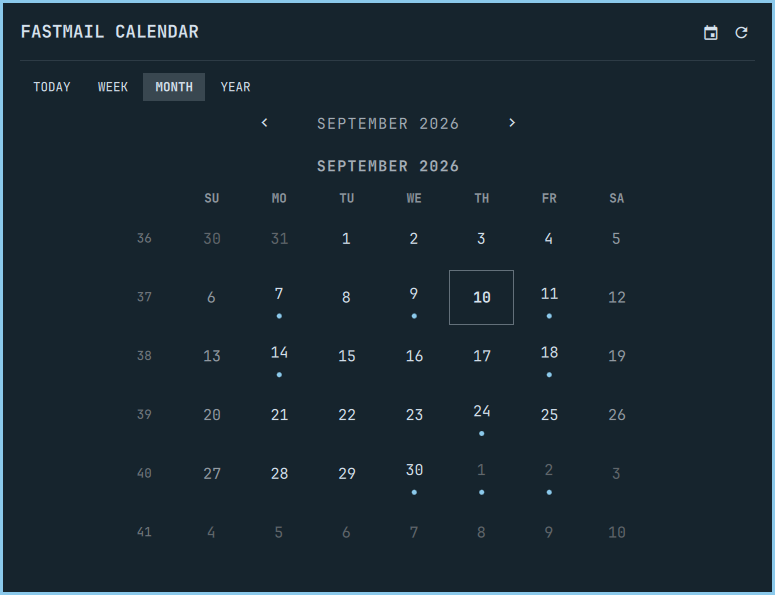

# Fastmail Calendar for Omarchy

A native Omarchy calendar — Today, Week, Month and Year views, with a day
detail for events and a quick add-event form — backed by CalDAV. Fastmail is the default and the
reason it exists, but **any CalDAV server works**: Nextcloud, Radicale,
Baïkal, iCloud, Google (via its CalDAV endpoint), a self-hosted DAViCal —
anything that speaks RFC 4791. No external CLI, no mail, no journal: this
plugin reads your calendars, shows them, and can add an event.



## Why CalDAV and not Fastmail's API

Fastmail exposes mail, contacts and masked email over JMAP, to API tokens
and to OAuth clients alike, but **not calendars** — there is no calendar
scope on either credential type, and Fastmail's own developer docs say to
use CalDAV until the JMAP Calendars spec is finalized. So this plugin speaks
CalDAV with a Fastmail **app password** scoped to calendars only, which is
exactly what every other third-party calendar client does. The upside is
that the same code reads any other CalDAV server too.

## What it does

- **Today/Week/Month/Year views**, laid out the same way as
  [omarchy-hey-calendar](https://github.com/ninepointlabs/omarchy-hey-calendar)
  (itself modeled on the native Omarchy calendar popup): a grid that never
  resizes between months, ISO week numbers, a day-detail overlay opened by
  clicking any day.
- **Every calendar on your account**, discovered per RFC 6764
  (`/.well-known/caldav` → principal → calendar home), each independently
  shown or hidden, with its own color (read from the server when it
  publishes one) and an optional display name override — your choices
  persist by the calendar's own path, so they survive the server reordering
  or renaming a calendar. Task-only collections and scheduling in/outboxes
  are skipped.
- **Recurring events**, expanded client-side from the iCalendar `RRULE`:
  daily/weekly/monthly/yearly, with `INTERVAL`, `COUNT`, `UNTIL`, `BYDAY`
  (including "2nd Tuesday" and "last Friday" forms), `BYMONTHDAY` and
  `BYMONTH`. `EXDATE` exceptions and `RECURRENCE-ID` instances (moved,
  retitled, or cancelled occurrences) are honored. `BYSETPOS`, `BYYEARDAY`,
  `BYWEEKNO`, `RDATE`, `RANGE=THISANDFUTURE` and sub-daily frequencies are
  out of scope — an event using one of those still shows on its own start
  and whatever the rest of its rule yields, just not every occurrence.
- **Correct times across zones and DST.** iCalendar events carry a local
  time plus a `TZID`, not a fixed offset; this plugin converts that pair to
  an absolute instant through the platform's own time zone database (via
  `Intl`), so a recurring 9am meeting reads as 9am both before and after a
  DST change, in whatever zone it was scheduled in. A `TZID` the platform
  does not know (Windows-style names such as "Central Standard Time") is
  read as a floating time, i.e. as typed, in your zone. All-day events are
  read from their date alone, never shifted by a zone.
- **Add an event** from any day's detail (or the Today view): title, all-day
  or a start/end typed the way you'd type it ("9", "9:30am", "21:30"),
  optional location, and which calendar. It is written as one iCalendar
  object with `If-None-Match: *`, so it can never overwrite anything. An end
  earlier than the start means the next day; an end equal to the start
  means an hour.
- **The bar chip** shows today's date, or (by default) your next event today.
  Right-click cycles the date format; middle-click refreshes.

There is no edit or delete for events yet, and no journal.

## Setup

```bash
omarchy plugin add https://github.com/ninepointlabs/omarchy-fastmail-calendar.git --enable
```

Click the calendar chip in the bar. **Connect calendar…** opens a floating
terminal that asks for three things:

1. **Server URL** — press Enter for Fastmail (`https://caldav.fastmail.com`),
   or type another server. A bare `https://host` is bootstrapped through
   `/.well-known/caldav`; a URL with a path (say
   `https://cloud.example.org/remote.php/dav`) is used as the starting point
   as given. Only `https://` is accepted.
2. **Username** — usually your email address.
3. **App password** — hidden as you type. For Fastmail: **Settings →
   Privacy & Security → Integrations → App passwords → New app password**,
   and limit its access to **Calendars (CalDAV)** — that scope is what
   lets the plugin both read and add events. See Fastmail's
   [App passwords](https://www.fastmail.help/hc/en-us/articles/360058752854-App-passwords)
   help page. Other servers have their own equivalent (Nextcloud calls them
   app passwords too; iCloud calls them app-specific passwords).

The terminal checks the credentials against the server before storing
anything; if the server rejects them (or is not reachable) it says so and
nothing is saved. On success the password goes straight into your system
keyring via `secret-tool` (libsecret), with the server URL and username as
attributes on the same keyring entry, and the terminal closes.

The credentials live under this plugin's own keyring entry
(`service=ninepointlabs.fastmail-calendar account=caldav`) — they are not
shared with, or read from, any other tool on this machine, including
`fm-cli`'s own app password or Hermes's Fastmail OAuth cache. Only one setup
runs at a time; a second click while one is in progress is refused rather
than opening a second terminal.

**Calendars** in the panel (the calendar icon, or press `C`) lists every
calendar on the account with a visibility toggle, a color swatch picker, and
an optional display-name field. **Forget calendar credentials** at the
bottom removes the stored entry (`secret-tool clear`); the plugin then asks
you to connect again next time you open it.

## Keys

With the panel open:

| Key | Action |
|---|---|
| `↑` `↓` `←` `→` | Move through month/week/year |
| `Enter` | Jump to today |
| `1` `2` `3` `4` | Today / Week / Month / Year |
| `C` | Calendars |
| `R` | Refresh |
| `Esc` | Close a detail page, then the panel |
| `Tab` `Shift+Tab` | Switch to the next or previous bar panel |

## Security

This plugin never runs a mail or calendar CLI: it talks CalDAV over HTTPS
through `curl` — as a bounded child process, output-size- and time-capped,
the same as every other Ninepoint Labs Omarchy plugin.

- The password is never a command-line argument, never written to a file,
  and never logged. It travels `secret-tool lookup` → a shell variable → a
  `curl -K -` (config supplied on stdin) `user =` line, inside one
  short-lived process; a lookup failure, or a stored value containing a
  control character, refuses the request rather than risk it breaking the
  config line it is interpolated into. Backslashes and double quotes are
  escaped for curl's config parser, so any other character is fine.
- `curl` runs with `--proto =https` and `--max-redirs 0`: only HTTPS is
  ever used, and redirects are followed by this plugin's own code (five at
  most, HTTPS only, and only to the configured server's own host or another
  host under its domain, e.g. `caldav.icloud.com` → `p01-caldav.icloud.com`),
  so the credentials are never replayed to a host outside the server you
  configured. Hrefs the server returns are reduced to paths on the
  configured origin; any href on another origin is ignored.
- Server responses are parsed by a linear-time XML scanner and iCalendar
  reader with nesting caps, recurrence expansion is bounded to the visible
  window with a per-fetch budget, and every parse runs under a guard, so a
  hostile or broken server can make the panel show an error but cannot
  hang or wedge the shell. Response framing uses a per-request random
  boundary so a body cannot forge a status.
- The setup terminal's `read` for the password is echo-off and the password
  is never assembled into a command line, so it never reaches shell
  history. The server URL and username are passed to `secret-tool store` as
  arguments (they are attributes, not secrets).
- Every value the server returns — titles, descriptions, locations,
  calendar names, XML, iCalendar — is treated as untrusted plaintext:
  bounded in size, control/bidi/zero-width characters stripped, and always
  rendered as plain text, never HTML. The XML reader never expands entities
  beyond the five predefined ones and numeric references, so DOCTYPE tricks
  do nothing.
- Calendar paths from the account are only ever compared, stored, and
  passed to `curl` as argv, never interpolated into a shell string. The
  only write is the add-event `PUT`, to a fresh, plugin-generated href
  inside the chosen calendar, with `If-None-Match: *` so the server refuses
  to replace an existing object; nothing is ever updated or deleted.
- `omarchy plugin remove` deletes the checkout and the plugin's saved
  settings in `shell.json`, but not the keyring entry. Use **Forget
  calendar credentials** first, or `secret-tool clear service
  ninepointlabs.fastmail-calendar account caldav`, to remove the credential
  itself.

For reviewers, this is everything the plugin executes:

```text
secret-tool search  service ninepointlabs.fastmail-calendar account caldav   (attributes only: server, username)
secret-tool lookup  service ninepointlabs.fastmail-calendar account caldav   (the password, inside the request script)
curl -K - -X PROPFIND -H 'Depth: 0' <start url | principal>                 (discovery)
curl -K - -X PROPFIND -H 'Depth: 1' <calendar home>                         (calendar list)
curl -K - -X REPORT   -H 'Depth: 1' <each calendar>                         (calendar-query for the visible window)
curl -K - -X PUT -H 'If-None-Match: *' <calendar>/<new uid>.ics             (Add event — the plugin's only write)
secret-tool clear  service ninepointlabs.fastmail-calendar account caldav   (setup, and Forget calendar credentials)
secret-tool store  service ninepointlabs.fastmail-calendar account caldav server <url> username <name>   (setup, in a floating terminal)
omarchy-launch-floating-terminal-with-presentation '<setup script, quoted>'
```

## Tested servers

- **Fastmail** — the default. Discovery goes `/.well-known/caldav` →
  `/dav/calendars` → `/dav/principals/user/<you>/` →
  `/dav/calendars/user/<you>/`; calendar colors and order come through
  Apple's `calendar-color` / `calendar-order` properties.

Other servers follow the same RFC 6764/4791 path and are expected to work;
if yours does not, the panel's status line shows which step failed (HTTP
status and address). Reports welcome.

## Demo and tests

```bash
node --test tests/model.test.cjs
```

Pure JS: date/grid math, timezone-safe recurrence expansion, CalDAV
discovery and request framing, WebDAV multistatus and iCalendar parsing
(including `EXDATE`/`RECURRENCE-ID` handling across a real DST change),
iCalendar generation for new events, the credential/setup scripts' shape,
and calendar preference persistence. There
is no Quickshell/QML test harness in this checkout yet — the QML files
follow the same structure as `omarchy-hey-calendar`'s and are lint-clean
under `qmllint`, but exercising them needs a live Omarchy shell.

## Updating and removal

```bash
omarchy plugin update ninepointlabs.fastmail-calendar --yes
omarchy plugin remove ninepointlabs.fastmail-calendar --yes
```

## Credits

Adapted from Ninepoint Labs' [omarchy-hey-calendar](https://github.com/ninepointlabs/omarchy-hey-calendar)
and [omarchy-fastmail](https://github.com/ninepointlabs/omarchy-fastmail)
(both MIT). Full attributions are in
[THIRD_PARTY_NOTICES.md](THIRD_PARTY_NOTICES.md).

Fastmail is a trademark of Fastmail Pty Ltd. This plugin is not affiliated
with or endorsed by Fastmail.

## License

MIT. See [LICENSE](LICENSE).
